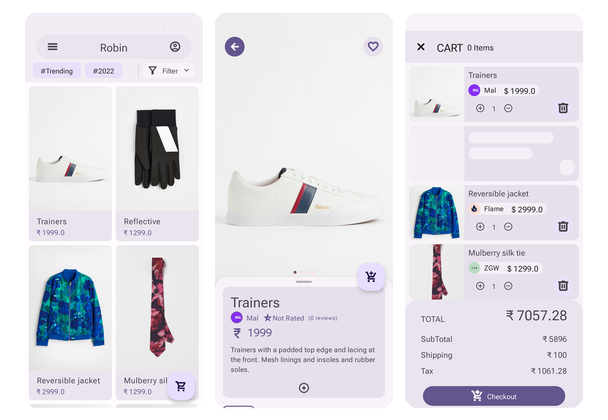
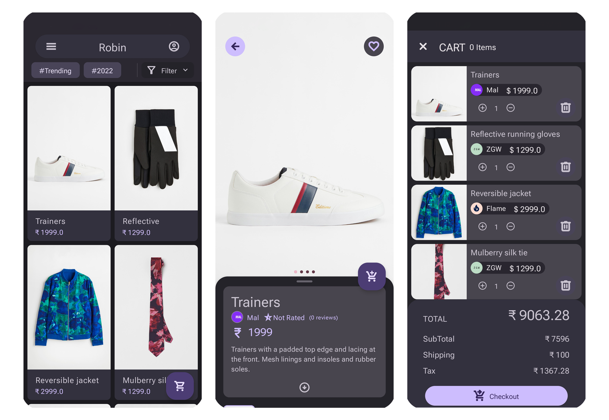

## In Progress
# Robin
Robin is a retail app that uses Material You/Material3 components and Material Theming to express branding for a variety of fashion and lifestyle items. The Robin app provides an online marketplace featuring lifestyle and fashion items from promoted labels. Robins’s brand aesthetic is modern, elegant, and sophisticated. Robin is the unifying concept behind the various brands and products showcased.

### Minimal aesthetic
Robin  uses a minimalist aesthetic, creating an experience where content and actions take the forefront of the user experience. Robin’s brand plays an important role as the central, unifying scaffolding for the variety of products and brands showcased.

## :sparkler: Features
1. Gradle build based on Kotlin script
2. Use Firebase Firestore as Database
3. Use Firebase Storage as FileStorage provider
4. Use Jetpack Compose
5. Dependency Injection using Dagger Hilt
6. Implements Model-View-ViewModel
7. Uses Android 12 Splash Api
8. Use New Material You / Material 3 design language

## :scissors: Scarped Features
1. [UnsplashApi](https://unsplash.com/developers) For Images Storage
2. Image Carousels based on [Unsplash](https://unsplash.com/developers) [BlurHash](https://blurha.sh/)
4. [BlurHash](https://blurha.sh/) Decoding for Blur Loading Images
5. [Ktor](https://ktor.io/docs/getting-started-ktor-client.html) Client for Web Service
6. Icon Interpolator
7. [Paging](https://developer.android.com/topic/libraries/architecture/paging/v3-overview) for items paging loading

## :wrench: Need to implement these Feature
- [ ]  Firebase Cloud Function as Backend
- [ ]  Need to add sorting and filters for products.
- [ ]  Need to add Search.
- [ ]  Unit Testing need to increase coverage.
- [ ]  Instrument Test need to increase coverage.
- [x]  redesign home ui.
- [ ]  Migrate from android view calendar To Compose
- [ ]  More Animation for responsive ui
- [ ]  product loading using paging
- [ ]  Need to add Favourite screen

## :bug: Known bug
- [ ] un-authenticated user causes crash when user need to be authenticated
- [ ] login checks failing
- [ ] item with no review causing ui bug on product page
- [ ] cart individual item sometimes not properly loading
- [ ] complete todo list

### Feel free to add issue to issuetracker
# Design file click here
<iframe style="border: 1px solid rgba(0, 0, 0, 0.1);" width="800" height="450" src="https://www.figma.com/embed?embed_host=share&url=https%3A%2F%2Fwww.figma.com%2Ffile%2F9LYXdzt9kSTt1tRVkt2iw1%2FRobinApp-Design%3Fnode-id%3D229%253A1043%26t%3Df9mPKdLzIaJrctf6-1" allowfullscreen></iframe>

